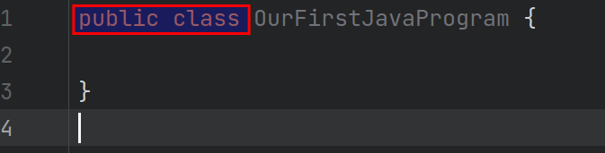
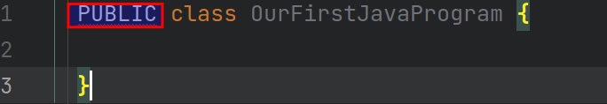
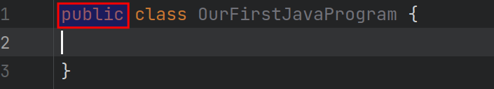

# 2.Our First Java Program

## 2.1 First Create the program

### 2.1.1 Java keywords

As you can see , the word public and class have different color, which means they are keywords in Java(the word have specific function).
The keywords are case-sensitive,so if public is capitalized , it will not be recognised by IDE.

the public there is the access modifier, which is optional